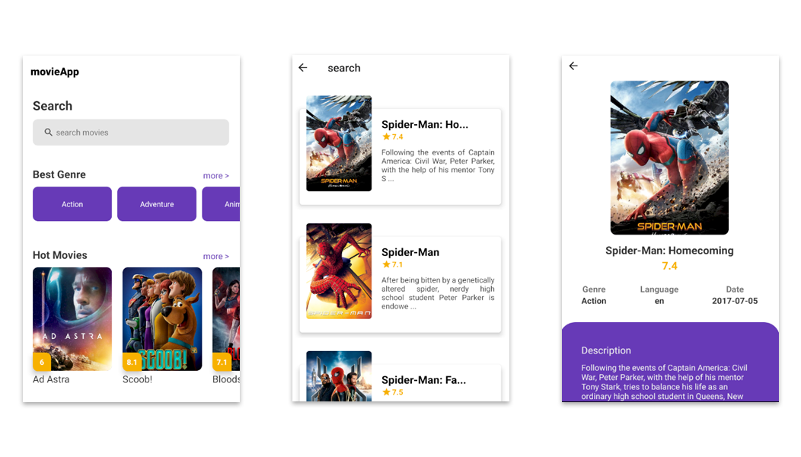

<h1 align="center">
  :movie_camera:
  <br>
  <br>
  movieApp
</h1>

<h3 align="center">
<strong></strong>
</h3>

<p align="center">

  
  
  
  
  <br>
  <br>
  <a href="#space_invader-technologies">Technologies</a> |
  <a href="#information_source-how-to-use">How to use</a>
  <br>
  <br>
  
  <br>
</p>

## :space_invader: Technologies

- React Native
- Typescript
- [React Navigation v5](https://reactnavigation.org/docs/getting-started/)
- Styled Components
- Axios
- [TMDb API](https://www.themoviedb.org/)

## :information_source: How to use

To run this project you'll need [GIT](https://git-scm.com/), [NodeJS](https://nodejs.org/en/) and [Yarn](https://yarnpkg.com/) installed on your computer.

```bash
# Clone this repository
$ git clone https://github.com/rafashiga/movieApp.git

# Go into the repository
$ cd movieApp

# Install dependencies
$ yarn install

# Run the project
$ yarn run android
```
